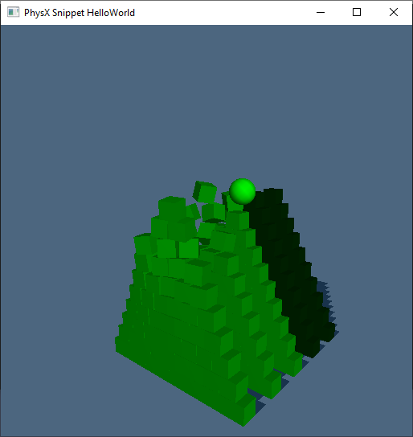
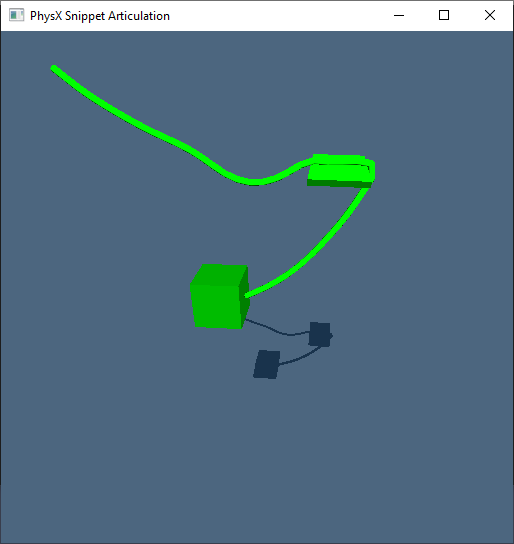
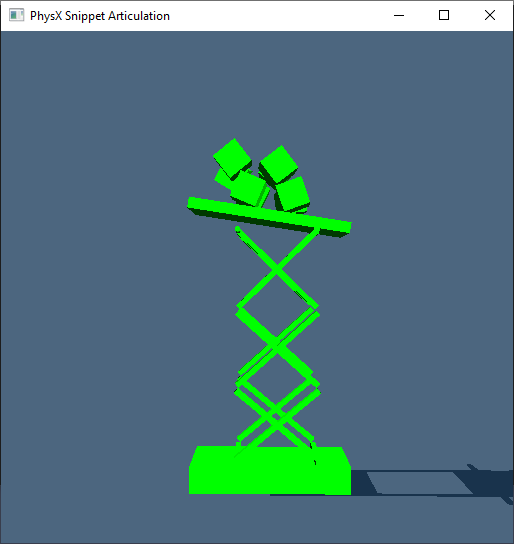
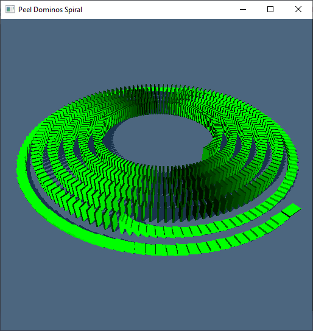
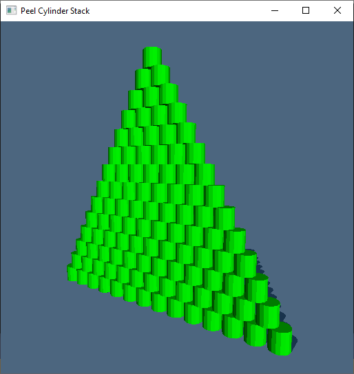
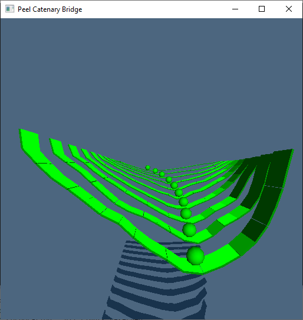

# PhysX examples from the PhysX SDK

## PhysX SDK Snippets
<table style="border-collapse: collapse; border: none; text-align: center; font-weight: bold;">
  <tr>
    <td></td>
    <td></td>
    <td></td>
  </tr>
  <tr>
      <td>Hello World</td>
      <td>Articulation (PhysX 3.4)</td>
      <td>Articulation (PhysX 4.1)</td>
  </tr>
 </table>

 ## PEEL Test Scenes
 <table style="border-collapse: collapse; border: none; text-align: center; font-weight: bold;">
   <tr>
     <td></td>
     <td></td>
     <td></td>
   </tr>
   <tr>
       <td>Dominos Spiral</td>
       <td>Cylinder Stack</td>
       <td>Catenary Bridges</td>
   </tr>
  </table>

 ## References
  - [NVIDIA PhysX SDK 3.4](https://github.com/NVIDIAGameWorks/PhysX-3.4)
  - [NVIDIA PhysX SDK 4.1](https://github.com/NVIDIAGameWorks/PhysX)
  - [PEEL - Physics Engine Evaluation Lab](https://github.com/Pierre-Terdiman/PEEL)
